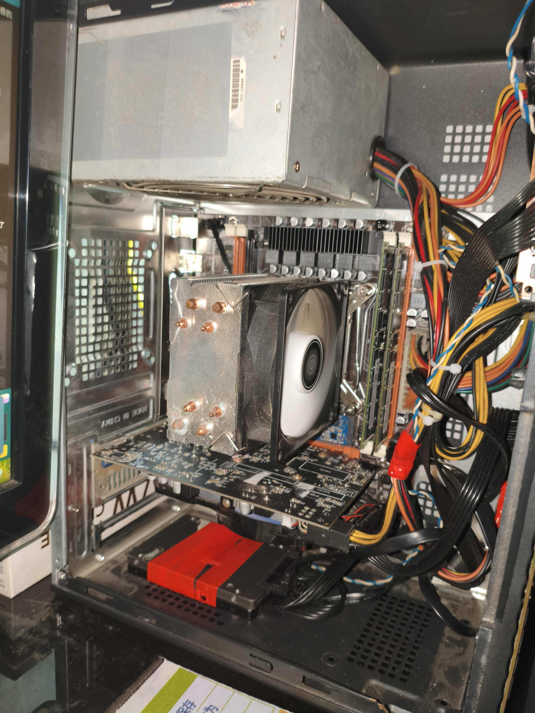
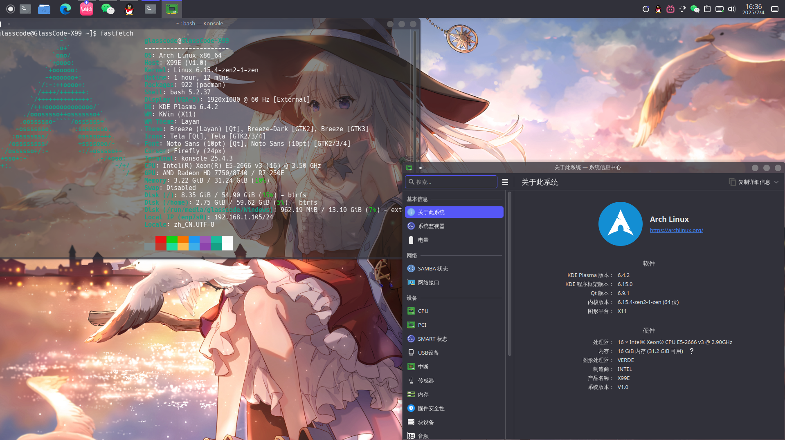
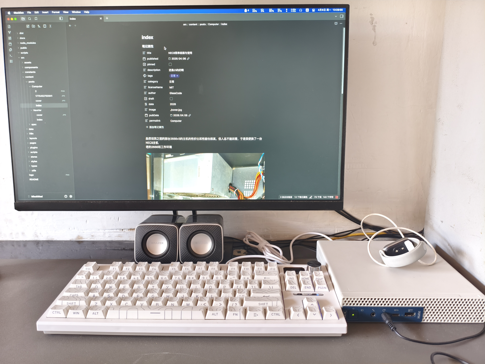
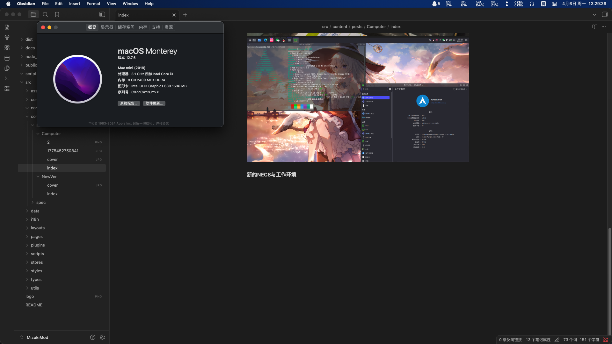
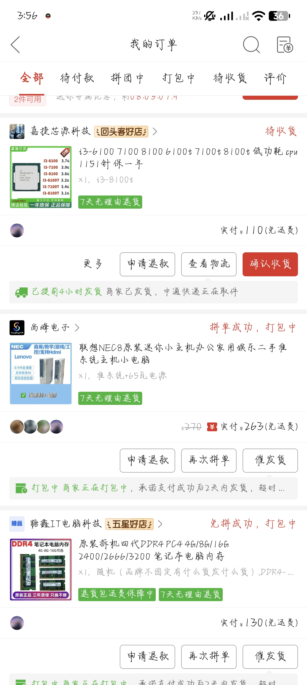
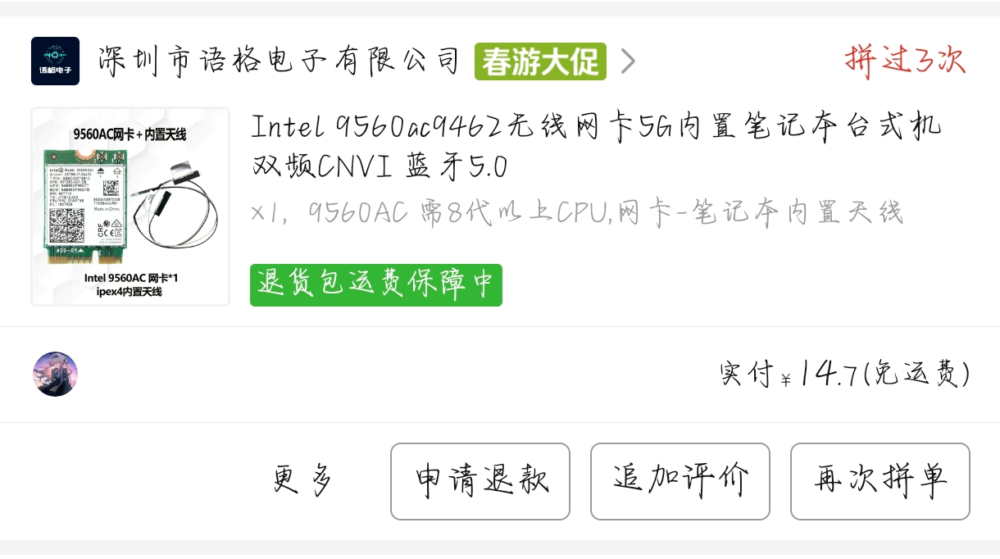
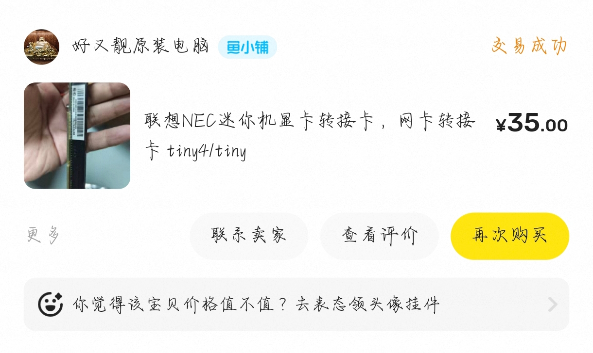

虽然说我之前的那台2666v3的主机的性价比和性能也很高，但人总不能闲着，于是我便换了一台NEC8主机
**老的2666和工作环境**

**新的NEC8与工作环境**

接下来就分享一下我的折腾过程吧
# 购买配件
## 三大件
主机的价格还是很正常，市场价差不多就这个价格，主机加65w电源，因为我没有上刀卡的打算，65w够了。
对于cpu，果断选择当年也是最有性价比的i3 8100的低功耗版本，8100t，性能还行，主要是低功耗和核显。
对于内存，这就很逆天了，4g的2666当时已经130rmb，but我这边一堆垃圾，所以说没有d4的条子，更不要说笔记本版本的了。

## 其他配件
pcie拓展卡，还是有未来装点拓展卡需求的，那就上。至于网卡，也是必备品，上吧。硬盘同城自提一个七彩虹256G NVME，健康度什么都都很不错，主要是现在的硬盘价格太贵了。硬盘图没了，价格是180左右。

网卡9560AC到手是9560NGW，性能更强一些，基本是8代u能上的显卡极限了
## 价格计算
这里的内存价格是很不切合实际的，当时正值涨价潮
后面又上了根4g条子，价格就要近200了，但没办法，只能上了
加起来差不多1000以内搞定，把内存溢价去掉就700到800吧

# 组装和折腾
## 硬件
正如网上的图一样，比巴掌大一圈，可上台式机U，有两个笔记本内存插槽，和一个nvme硬盘接口，其实还有一个空焊位，咸鱼30元就可以获得第二个硬盘口，同时还有一个sata口，就是得加钱买转接线。（其实上图找不到而且懒得关机再拍一遍导致的，后面再修补）
## 软件
这机子很适合折腾黑苹果，网上也有现成的EFI文件，大部分都是完美的，我也便装了MacOS12系统

macOS优点无须多言，色彩管理优秀，内存调度高效和对code的适配是win比不了的，虽然说linux是最棒的
# 实际表现
借助macOS的资源管理，在关了swap的情况下，浏览器开4个网页，vsc+nodejs+黑曜石+steam挂着下游戏+github desktop情况下依旧是十分流畅，虽然说内存压力已经到2档了

诸如白色颜值高，平常噪音小就不说了
# End
综合来看，如何你想要一台有Mac mini2018体验（可以上白苹果拆机网卡），并且价格也很实惠（跳过内存涨价），自定义程度高（可上3050之类的刀卡）的高颜值小主机，nec8还是很不错的。